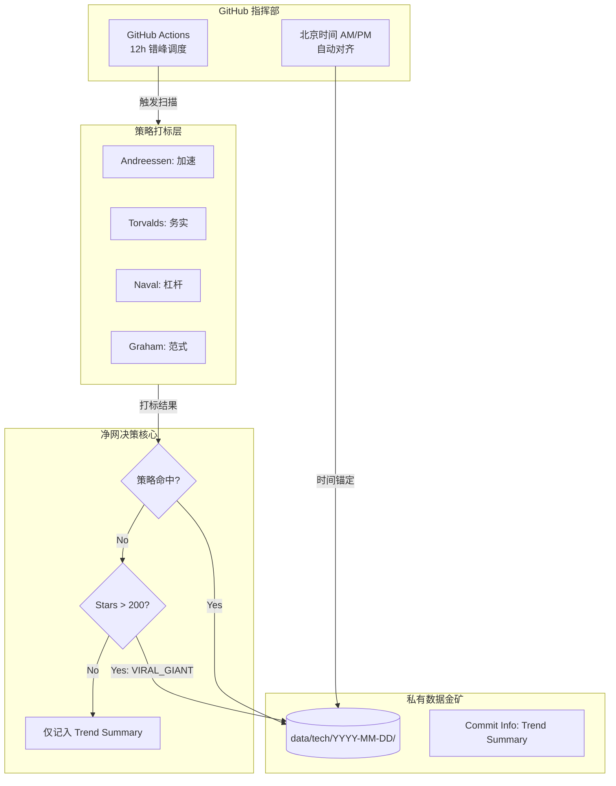

# 🌍 GitHub Sentinel (技术趋势监测哨兵)

> **"Code is the blueprint of the future, but only the elite 1% matters."**
> 一个基于 GitHub 的全自动技术趋势监测系统。**大师策略加持，双引擎驱动，高信噪比。**

---

## 🚀 核心架构：大师增强型双引擎

本系统引入了**全量统计、精英入库**机制，不再仅仅是搬运 Repo，而是对全球代码演进进行“智力审计”。

### 1. 📡 一号引擎 (Global Sweep - 守正)

* **职责**：广域扫描。每 12 小时扫描过去 24 小时内全球 Star 增长最快的项目。
* **特性**：对齐北京时间 (UTC+8) 的 AM/PM 双频巡逻，确保捕捉到每一个时区的爆发点。

### 2. 🧹 二号引擎 (Elite Filter - 出奇)

* **职责**：净网决策。应用大师逻辑对海量 Repo 进行去噪处理。
* **特性**：**策略命中制** + **高热度强制保留**。自动剔除“人才成长类”噪音，只留硬核信号入库。

---

## 🧠 大师思维模型 (Tech Strategy Engine)

系统通过 4 位科技泰斗的逻辑对数据进行实时打标，结果存储于 JSON 的 `tags` 字段中：

| 大师 (Master) | 核心逻辑 (Logic) | 识别信号 (Keywords) | 科技价值 |
| --- | --- | --- | --- |
| **安德森 (Andreessen)** | **科技加速** | `agi`, `infra`, `cuda`, `weights` | 捕捉 AI 重工业基础设施及模型算力突破点 |
| **托瓦兹 (Torvalds)** | **核心务实** | `rust`, `kernel`, `runtime`, `performance` | 识别高性能底层代码及“不玩虚的”系统级创新 |
| **纳瓦尔 (Naval)** | **代码杠杆** | `agent`, `protocol`, `autonomous`, `sdk` | 锁定能赋予个人极大生产力的“无许可”杠杆工具 |
| **格雷厄姆 (Graham)** | **范式转移** | `alternative to`, `new way`, `reimagining` | 捕捉试图重新定义现有问题、具备黑马潜质的早期创新 |

---

## 🏷️ 策略标签实战定义 (Tag Definitions)

当大师信号出现或市场发生异动时，JSON 数据中会出现以下标识：

* **`TECH_ACCELERATOR` (科技加速)**
* **出现条件**：命中安德森策略。
* **策略含义**：该项目是当前 AGI 浪潮的燃料。代表生产力底层的爆发，优先级最高。
* **`CORE_PRAGMATISM` (核心务实)**
* **出现条件**：命中托瓦兹策略。
* **策略含义**：极其硬核的代码，通常涉及性能极限或底层重构。是观察技术“深度”的标尺。
* **`CODE_LEVERAGE` (代码杠杆)**
* **出现条件**：命中纳瓦尔策略且具备一定的 Fork 活跃度。
* **策略含义**：这是一把新的“武器”。它能让开发者实现指数级的生产力释放。
* **`VIRAL_GIANT` (不明巨物)**
* **出现条件**：未命中策略但 24h 内 Stars > 200。
* **策略含义**：**终极保险标签**。防止由于系统尚未定义的新物种或突发性社会热点导致的技术爆发现象漏网。
* **`TALENT_GROWTH` (人才风向)**
* **出现条件**：命中 SKILLS/ROADMAP 类关键词。
* **策略含义**：噪音信号。详情不入库，仅作为观察“当前工程师在学什么”的宏观指标。

---

## 🛠️ 系统架构图



---

## 🛡️ 技术监测准则 (Filtering Rules)

Sentinel 内置严格的“净网”机制，确保你看到的永远是硬核资产：

| 领域 (Category) | 监测核心 (Signals) | 剔除噪音 (Noise) |
| --- | --- | --- |
| **AI / ML** | 模型权重、推理引擎、RAG 框架 | 简单的 Prompt 列表、AI 导航站 |
| **System** | 驱动程序、虚拟化技术、编译优化 | 针对初学者的 OS 教程、基础笔记 |
| **Automation** | 浏览器 Agent、无头浏览器、SDK | 针对特定网站的简单脚本、插件 |
| **Infrastructure** | 分布式协议、数据库内核、存储引擎 | 静态博客模版、常规网页 UI |

---

## 🕹️ 运行与配置

### 1. 查看数据报告

数据以结构化 JSON 存储，头部包含 `trend_summary` 宏观简报：

```json
{
  "meta": {
    "scanned_at_bj": "2026-01-28T23:26:12Z",
    "session": "PM",
    "trend_summary": {
      "TALENT_GROWTH": 4,
      "VIRAL_GIANT": 2,
      "TECH_ACCELERATOR": 4,
      "CODE_LEVERAGE": 2
    }
  },
  "items": [
    {
      "name": "deepseek-ai/DeepSeek-OCR-2",
      "tags": ["TECH_ACCELERATOR"],
      "reason": "STRATEGY",
      "url": "https://github.com/..."
    }
  ]
}

```
